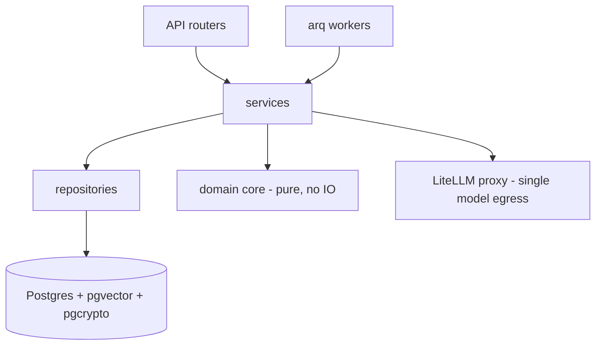

# Glasshouse — Backend

  

FastAPI service for the **Attack → Measure → Defend** engine. Part of the
[glasshouse](../Privacy-Exposure-App) project — the full spec (`docs/`) and the
UI prototype live in the hub repo.

## Develop
```bash
make sync        # install dependencies (uv)
make hooks       # install the pre-commit git hooks (once)
make dev         # Postgres + Redis + hot-reload API → http://localhost:8000/healthz
make test        # pytest (spins a real Postgres via testcontainers — Docker must be running)
make check       # ruff (lint+format) + mypy --strict
```
The model egress (LiteLLM Proxy + Ollama) is declared under the `gateway` compose profile and
wired up at T3/M1.5: `docker compose --profile gateway up`. See `docs/` in the hub for the spec.

Interactive API reference: **`/scalar`** (rendered from the OpenAPI schema); FastAPI's `/docs` and `/redoc` are also available.

## Architecture
Clean / hexagonal layering — dependencies point inward; SQL lives only in `repositories/`, the
`domain/` core is pure (no IO), and **workers call the same services as the API** so logic never drifts.



**Stack:** FastAPI · SQLAlchemy 2.0 (async) + Alembic · `arq` (Redis) workers · pydantic v2 ·
`instructor` · `uv`. Layered (Clean Architecture): `app/{api,services,repositories,domain,workers,db,...}`.
See the hub's `docs/` for the authoritative spec and `docs/11-roadmap/tasks-backend.md` for the build order.
